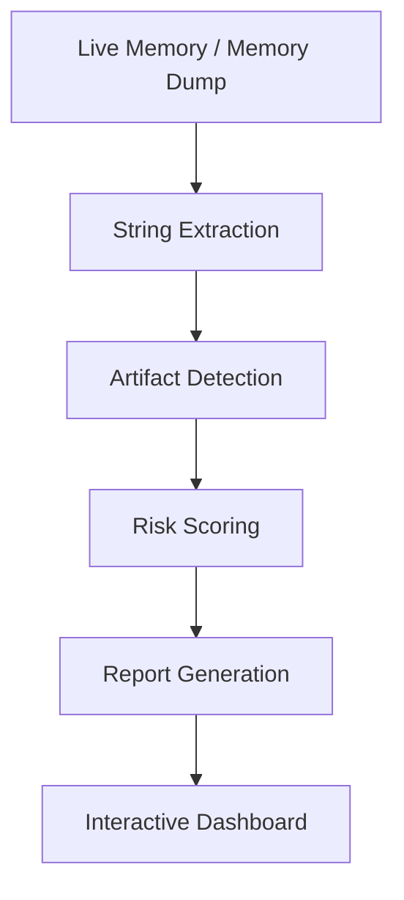

# Memory-Based-Cryptocurrency-Artifact-Detection-and-Forensic-Analysis-System


---

## Overview

SeedTrace is an automated memory forensics tool designed to detect cryptocurrency-related artifacts from volatile memory (RAM). It assists digital forensic investigators by analyzing memory dump files to recover sensitive wallet evidence, including BIP-39 seed phrases, Bitcoin and Ethereum addresses, private key indicators, transaction hashes, and wallet software traces.

The platform combines automated artifact detection, contextual analysis, forensic risk assessment, and report generation into a single workflow. Built with a Flask backend and a React-based web interface, SeedTrace enables investigators to perform cryptocurrency memory analysis efficiently without requiring extensive command-line interaction.

---

## Key Features

| Feature | Description |
|---------|-------------|
| 🔍 Memory Acquisition | Supports live memory acquisition using WinPmem |
| 📂 Memory Dump Analysis | Analyze `.raw`, `.mem`, and `.dmp` files |
| 🔐 Seed Phrase Detection | Detect BIP-39 mnemonic seed phrases |
| ₿ Bitcoin Detection | Identify Bitcoin wallet addresses |
| ⟠ Ethereum Detection | Detect Ethereum wallet addresses |
| 🔑 Private Key Indicators | Locate private key related traces |
| 🧾 Transaction Hash Detection | Detect blockchain transaction hashes |
| 💼 Wallet Trace Detection | Identify traces of wallet software |
| 📊 Risk Scoring | Automatically classify forensic severity |
| 📄 Report Generation | Generate detailed PDF and TXT forensic reports |
| 🌐 Web Dashboard | Interactive dashboard for visualization |

---

## Supported Artifacts

| Artifact | Supported |
|----------|-----------|
| BIP-39 Seed Phrase | ✅ |
| Bitcoin Address | ✅ |
| Ethereum Address | ✅ |
| Private Key Indicators | ✅ |
| Transaction Hash | ✅ |
| Wallet Software Traces | ✅ |

### Supported Wallets

- MetaMask
- Electrum
- Exodus
- Trezor
- Ledger

---

## Workflow



---

## System Architecture

```text
                 React Frontend
                        │
                 Flask REST API
                        │
     ┌────────────────────────────────────┐
     │                                    │
     │   Memory Acquisition               │
     │   String Extraction                │
     │   Artifact Detection               │
     │   Risk Scoring                     │
     │   Report Generation                │
     │                                    │
     └────────────────────────────────────┘
                        │
                PDF / TXT Reports
```

---

## Technology Stack

### Frontend

- React

### Backend

- Python
- Flask

### Memory Acquisition

- WinPmem

### Report Generation

- ReportLab

### Languages

- Python
- JavaScript
- HTML
- CSS

---

## Detection Modules

- BIP-39 Seed Phrase Detection
- Bitcoin Address Detection
- Ethereum Address Detection
- Private Key Indicator Detection
- Transaction Hash Detection
- Wallet Software Trace Detection
- Risk Scoring Engine

---

## Risk Classification

| Score | Severity |
|-------|----------|
| 0 – 5 | NONE |
| 6 – 25 | LOW |
| 26 – 45 | MEDIUM |
| 46 – 70 | HIGH |
| 71+ | CRITICAL |

---

## Repository Structure

```text
SeedTrace
│
├── backend/
├── frontend/
├── detector/
├── reporter/
├── tools/
├── reports/
├── screenshots/
├── docs/
├── requirements.txt
└── README.md
```

---

## Installation

### Clone the repository

```bash
git clone https://github.com/<your-username>/SeedTrace.git
```

### Navigate to the project

```bash
cd SeedTrace
```

### Install backend dependencies

```bash
pip install -r requirements.txt
```

### Run Backend

```bash
python api.py
```

### Run Frontend

```bash
npm install
npm run dev
```

---

## Results

- Successfully detects cryptocurrency artifacts from RAM.
- Supports automated forensic risk classification.
- Generates detailed PDF and TXT investigation reports.
- Demonstrates low false-positive detection through contextual analysis.
- Optimized for large memory dump analysis.

---

## Future Enhancements

- Volatility 3 Plugin
- Linux Support (LiME)
- macOS Support
- Machine Learning-based Artifact Detection
- Real-Time Memory Monitoring
- Support for additional cryptocurrencies

---

## Disclaimer

SeedTrace is intended solely for authorized digital forensic investigations, cybersecurity research, and educational purposes. The tool should only be used on systems for which explicit legal authorization has been obtained.

---

## Author

**Tanushree Shrikant Kadgi**

---

## License

This project is licensed under the MIT License.
